Beijing PM2.5 Prediction
================

### Introduction

The data set contains PM2.5 data of US Embassy in Beijing and meteorological data from Beijing Capital International Airport from Jan. 1, 2010 to Dec. 31, 2014. There are 41,757 observations of 13 variables: year, month, day, hour, PM2.5 concentration (pm2.5), dewpoint (DEWP), temperature (TEMP), pressure (PRES), combined wind direction (cbwd), cumulated wind speed (Iws), cumulated hours of snow (Is), and cumulated hours of rain (Ir). The aim of this project is to build a regression model to predict the PM2.5 concentration using these variables. I will also use correlation and graphical analysis to explore and find patterns in the data.

### Exploratory Data Analysis

#### PM2.5 (predicted variable)

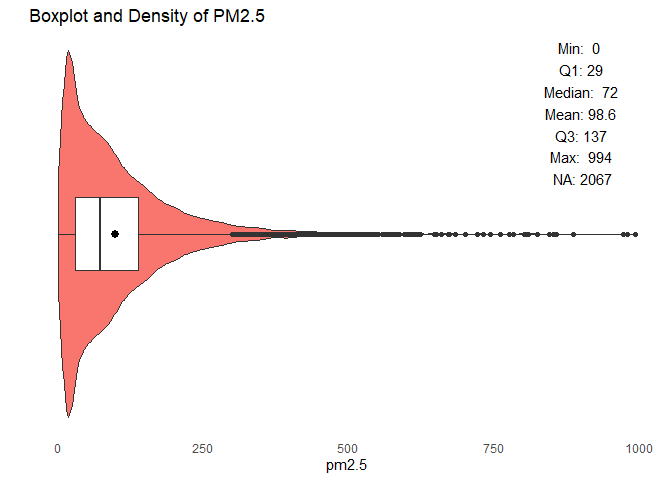

We find:

-   There are over 2,000 missing values.
-   There are many outliers that are at high/extremely high levels of pm2.5.
-   The distribution is not normal. It is heavily right-skewed.
-   Most of the values are near the first quartile (29).

#### Correlation Matrix

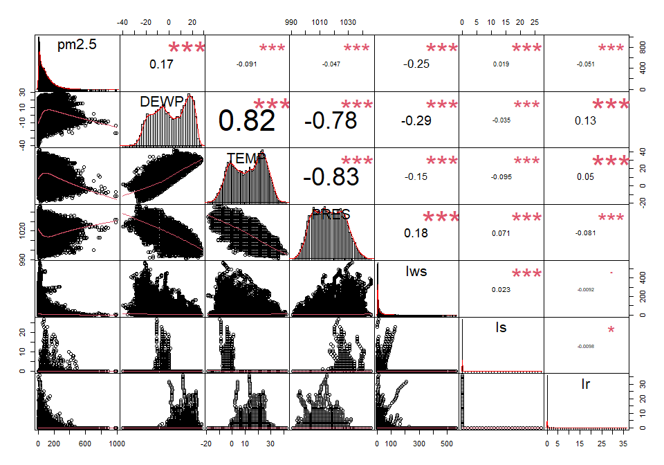

We see:

-   The distributions are non-normal.
-   The distributions for Iws, Is, and Ir are heavily skewed to the right with frequent values near 0.
-   There is a strong positive correlation between temperature and dewpoint.
-   There is a strong negative correlation between pressure and dewpoint.
-   There is a strong negative correlation between pressure and temperature.
-   There is a weak correlation between pm2.5 and cumulated wind speed, and pm2.5 and dewpoint.
-   There is no correlation between pm2.5 and the variables: temperature, pressure, cumulated hours of snow, and cumulated hours of rain.

#### Relationship between Temperature, Dewpoint, and Pressure across Time

#### Temperature and Dewpoint

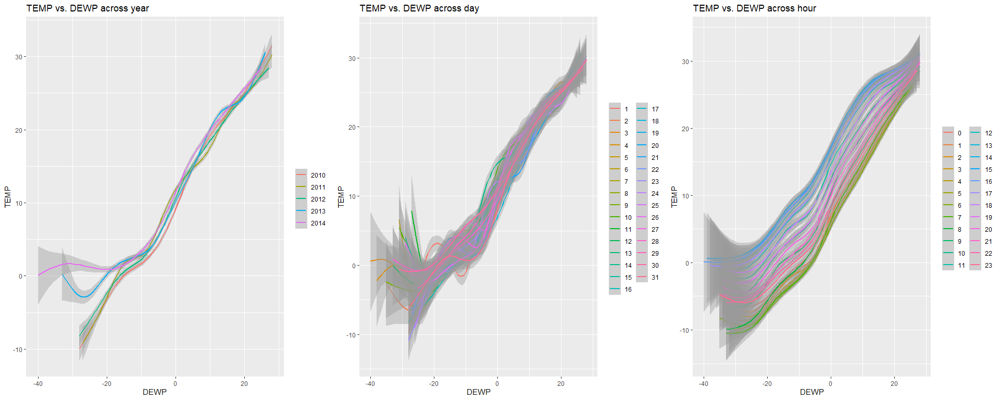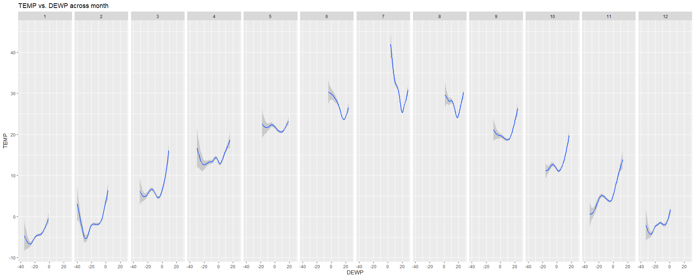

We see:

-   There is a positive relationship between temperature and dewpoint across years, days, and hours.
-   The trend between temperature and dewpoint differs across months.
-   Temperature and dewpoint differ across months and hours, but there is little change across years and days.
-   Temperature increases (dewpoint increases) from month 1 to month 7, then decreases.

#### Pressure and Dewpoint

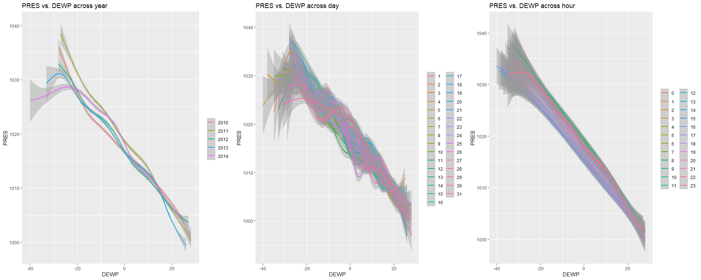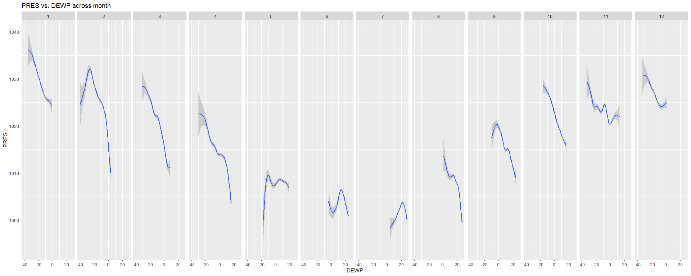

We see:

-   There is a negative relationship between pressure and dewpoint across years, days, and hours.
-   The trend between pressure and dewpoint differs across months, but it is generally negative.
-   Pressure and dewpoint differ across months, but there is little change across years, days, and hours.
-   Pressure decreases (dewpoint increases) from month 1 to month 7, then pressure increases (dewpoint decreases) onwards.

#### Pressure and Temperature

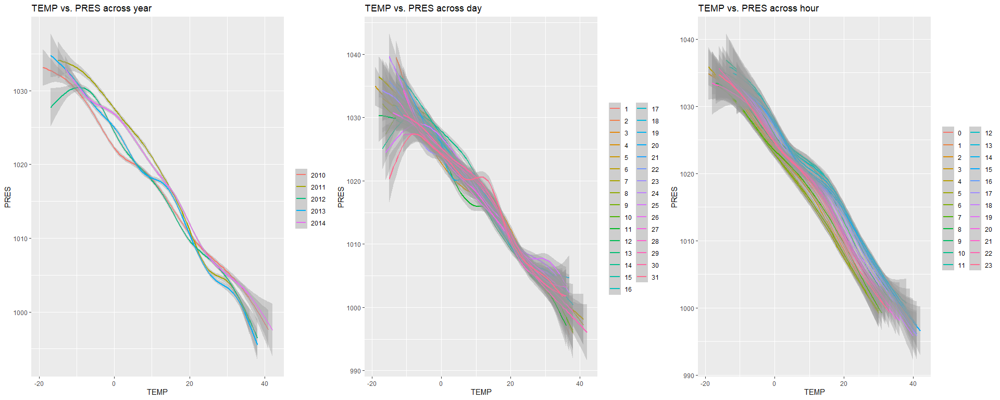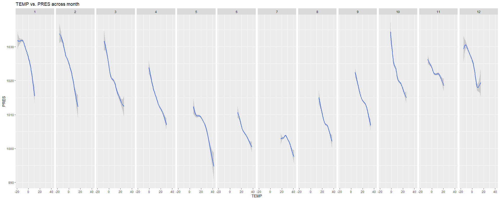

We see:

-   There is a negative relationship between pressure and temperature across years, months, days, and hours.
-   Pressure and temperature differs across months, but there is little change across years, days, and hours.
-   Pressure decreases (temperature increases) from month 1 to month 7, then pressure increases (temperature decreases) onwards.

#### PM2.5 across categorical variables

In this section, I will analyze pm2.5 across year, month, day, hour, and combined wind direction.
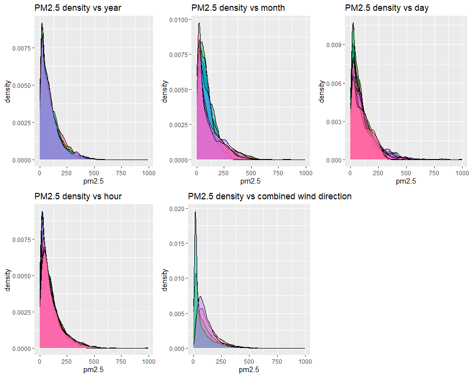

The density plots provide some insights:

-   The distributions of pm2.5 are heavily skewed to the right.
-   The distribution of pm2.5 across years have a similar distribution.
-   Year appears to have very little impact on pm2.5.
-   Day and hour appears to have a slight impact on pm2.5.
-   Month and wind direction appears to have a significant impact on pm2.5.

Next, I will analyze pm2.5 across years and months.
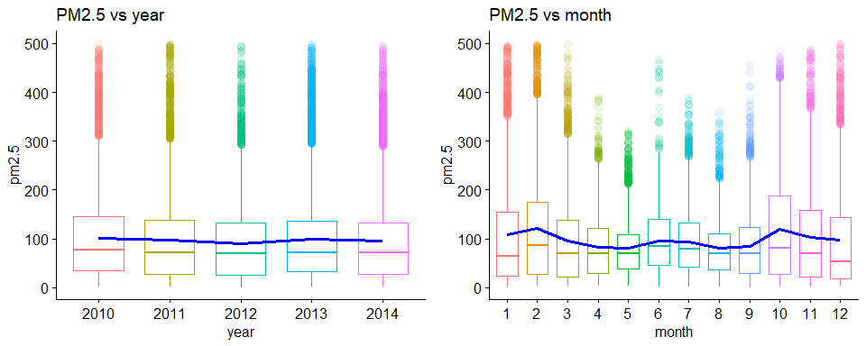

-   The boxplot shows outliers and five-number summary of pm2.5: min value, first quartile, median, third quartile, and max value.
-   The average pm2.5 for each year and month is connected by the blue line.

We see:

-   There are many outliers for each year and month.
-   There is little change in the average pm2.5 between years.
-   There are seasonal fluctuations in pm2.5.

Let's further analyze the relationship between pm2.5 vs. month, and see how patterns change across day and hour.
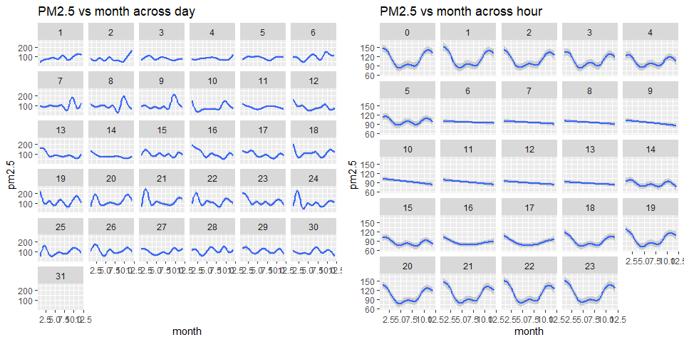

We see:

-   The pm2.5 appears to differ across days and hours, fluctuating by varying amounts. 
-   The pm2.5 appears less volatile on day 4, 5, 11, and 14 compared to other days of the month.
-   The pm2.5 appears less volatile between hours 6 and 13 compared to other hours.

Next, I will analyze the pm2.5 across combined wind directions.
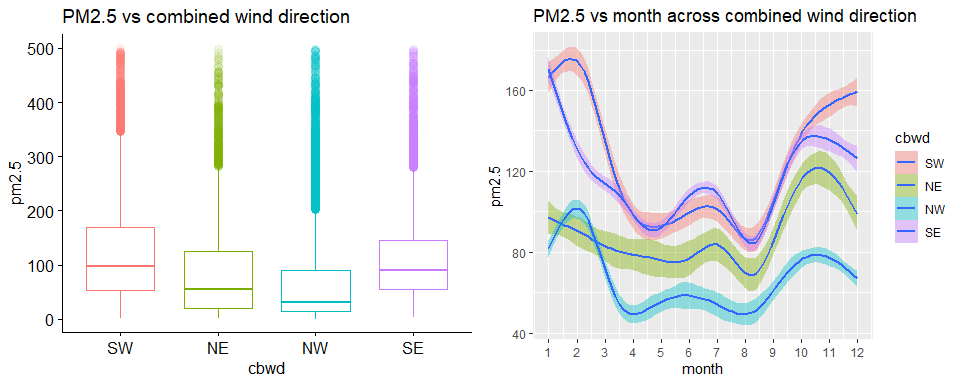

We see:

-   There appears to be significant differences in pm2.5 between cbwd groups.
-   The pm2.5 when cbwd is SW or SE is higher than that of NW and NE.
-   SW and NW have similar patterns: the pm2.5 increases from month 1 to month 2, then fluctuates between every two months. However when cbwd is SW, the pm2.5 continues to increase at a decreasing rate in month 10, while pm2.5 starts decreasing when cbwd is NW.
-   NE and SE also have similar patterns.

### Multiple Linear Regression

The proposed regression model is:

``` r
final_lm <- (lm(log10_pm2.5~
                  scale(DEWP)+ scale(TEMP)+ scale(PRES)+ scale(Iws)+ scale(Ir)+ month+ cbwd+
                  month*scale(DEWP)+ month*scale(TEMP)+ month*scale(PRES)+ month*scale(Iws)+
                  scale(Iws)*scale(DEWP),
                data=data))
```

Due to differences in units of numerical variables, I have decided to standardize the variables, which lets us compare them. In addition, I performed a log transformation on pm2.5 to normalize the skewed data.

##### Model Summary

<table class="table table-striped table-hover table-condensed table-responsive" style="width: auto !important; margin-left: auto; margin-right: auto;">
<tbody>
<tr>
<td style="text-align:left;font-weight: bold;">
Observations
</td>
<td style="text-align:right;">
41757
</td>
</tr>
<tr>
<td style="text-align:left;font-weight: bold;">
Dependent variable
</td>
<td style="text-align:right;">
log10_pm2.5
</td>
</tr>
<tr>
<td style="text-align:left;font-weight: bold;">
Type
</td>
<td style="text-align:right;">
OLS linear regression
</td>
</tr>
</tbody>
</table>
<table class="table table-striped table-hover table-condensed table-responsive" style="width: auto !important; margin-left: auto; margin-right: auto;">
<tbody>
<tr>
<td style="text-align:left;font-weight: bold;">
F(64,41692)
</td>
<td style="text-align:right;">
890.43
</td>
</tr>
<tr>
<td style="text-align:left;font-weight: bold;">
R²
</td>
<td style="text-align:right;">
0.58
</td>
</tr>
<tr>
<td style="text-align:left;font-weight: bold;">
Adj. R²
</td>
<td style="text-align:right;">
0.58
</td>
</tr>
</tbody>
</table>
<table class="table table-striped table-hover table-condensed table-responsive" style="width: auto !important; margin-left: auto; margin-right: auto;">
<thead>
<tr>
<th style="text-align:left;">
</th>
<th style="text-align:right;">
Est.
</th>
<th style="text-align:right;">
S.E.
</th>
<th style="text-align:right;">
t val.
</th>
<th style="text-align:right;">
p
</th>
</tr>
</thead>
<tbody>
<tr>
<td style="text-align:left;font-weight: bold;">
(Intercept)
</td>
<td style="text-align:right;">
2.47
</td>
<td style="text-align:right;">
0.02
</td>
<td style="text-align:right;">
120.85
</td>
<td style="text-align:right;">
0.00
</td>
</tr>
<tr>
<td style="text-align:left;font-weight: bold;">
scale(DEWP)
</td>
<td style="text-align:right;">
0.61
</td>
<td style="text-align:right;">
0.01
</td>
<td style="text-align:right;">
47.58
</td>
<td style="text-align:right;">
0.00
</td>
</tr>
<tr>
<td style="text-align:left;font-weight: bold;">
scale(TEMP)
</td>
<td style="text-align:right;">
-0.26
</td>
<td style="text-align:right;">
0.01
</td>
<td style="text-align:right;">
-20.02
</td>
<td style="text-align:right;">
0.00
</td>
</tr>
<tr>
<td style="text-align:left;font-weight: bold;">
scale(PRES)
</td>
<td style="text-align:right;">
-0.17
</td>
<td style="text-align:right;">
0.01
</td>
<td style="text-align:right;">
-16.89
</td>
<td style="text-align:right;">
0.00
</td>
</tr>
<tr>
<td style="text-align:left;font-weight: bold;">
scale(Iws)
</td>
<td style="text-align:right;">
-0.20
</td>
<td style="text-align:right;">
0.01
</td>
<td style="text-align:right;">
-30.50
</td>
<td style="text-align:right;">
0.00
</td>
</tr>
<tr>
<td style="text-align:left;font-weight: bold;">
scale(Ir)
</td>
<td style="text-align:right;">
-0.04
</td>
<td style="text-align:right;">
0.00
</td>
<td style="text-align:right;">
-26.81
</td>
<td style="text-align:right;">
0.00
</td>
</tr>
<tr>
<td style="text-align:left;font-weight: bold;">
month2
</td>
<td style="text-align:right;">
-0.04
</td>
<td style="text-align:right;">
0.03
</td>
<td style="text-align:right;">
-1.32
</td>
<td style="text-align:right;">
0.19
</td>
</tr>
<tr>
<td style="text-align:left;font-weight: bold;">
month3
</td>
<td style="text-align:right;">
-0.30
</td>
<td style="text-align:right;">
0.02
</td>
<td style="text-align:right;">
-13.40
</td>
<td style="text-align:right;">
0.00
</td>
</tr>
<tr>
<td style="text-align:left;font-weight: bold;">
month4
</td>
<td style="text-align:right;">
-0.58
</td>
<td style="text-align:right;">
0.02
</td>
<td style="text-align:right;">
-27.26
</td>
<td style="text-align:right;">
0.00
</td>
</tr>
<tr>
<td style="text-align:left;font-weight: bold;">
month5
</td>
<td style="text-align:right;">
-0.74
</td>
<td style="text-align:right;">
0.02
</td>
<td style="text-align:right;">
-32.10
</td>
<td style="text-align:right;">
0.00
</td>
</tr>
<tr>
<td style="text-align:left;font-weight: bold;">
month6
</td>
<td style="text-align:right;">
-1.38
</td>
<td style="text-align:right;">
0.03
</td>
<td style="text-align:right;">
-41.16
</td>
<td style="text-align:right;">
0.00
</td>
</tr>
<tr>
<td style="text-align:left;font-weight: bold;">
month7
</td>
<td style="text-align:right;">
-1.55
</td>
<td style="text-align:right;">
0.05
</td>
<td style="text-align:right;">
-33.17
</td>
<td style="text-align:right;">
0.00
</td>
</tr>
<tr>
<td style="text-align:left;font-weight: bold;">
month8
</td>
<td style="text-align:right;">
-1.49
</td>
<td style="text-align:right;">
0.03
</td>
<td style="text-align:right;">
-43.10
</td>
<td style="text-align:right;">
0.00
</td>
</tr>
<tr>
<td style="text-align:left;font-weight: bold;">
month9
</td>
<td style="text-align:right;">
-1.17
</td>
<td style="text-align:right;">
0.03
</td>
<td style="text-align:right;">
-46.89
</td>
<td style="text-align:right;">
0.00
</td>
</tr>
<tr>
<td style="text-align:left;font-weight: bold;">
month10
</td>
<td style="text-align:right;">
-0.76
</td>
<td style="text-align:right;">
0.02
</td>
<td style="text-align:right;">
-34.64
</td>
<td style="text-align:right;">
0.00
</td>
</tr>
<tr>
<td style="text-align:left;font-weight: bold;">
month11
</td>
<td style="text-align:right;">
-0.45
</td>
<td style="text-align:right;">
0.02
</td>
<td style="text-align:right;">
-19.95
</td>
<td style="text-align:right;">
0.00
</td>
</tr>
<tr>
<td style="text-align:left;font-weight: bold;">
month12
</td>
<td style="text-align:right;">
-0.07
</td>
<td style="text-align:right;">
0.03
</td>
<td style="text-align:right;">
-2.44
</td>
<td style="text-align:right;">
0.01
</td>
</tr>
<tr>
<td style="text-align:left;font-weight: bold;">
cbwdNE
</td>
<td style="text-align:right;">
-0.11
</td>
<td style="text-align:right;">
0.01
</td>
<td style="text-align:right;">
-21.24
</td>
<td style="text-align:right;">
0.00
</td>
</tr>
<tr>
<td style="text-align:left;font-weight: bold;">
cbwdNW
</td>
<td style="text-align:right;">
-0.14
</td>
<td style="text-align:right;">
0.00
</td>
<td style="text-align:right;">
-32.71
</td>
<td style="text-align:right;">
0.00
</td>
</tr>
<tr>
<td style="text-align:left;font-weight: bold;">
cbwdSE
</td>
<td style="text-align:right;">
0.05
</td>
<td style="text-align:right;">
0.00
</td>
<td style="text-align:right;">
11.39
</td>
<td style="text-align:right;">
0.00
</td>
</tr>
<tr>
<td style="text-align:left;font-weight: bold;">
scale(DEWP):month2
</td>
<td style="text-align:right;">
-0.03
</td>
<td style="text-align:right;">
0.02
</td>
<td style="text-align:right;">
-1.69
</td>
<td style="text-align:right;">
0.09
</td>
</tr>
<tr>
<td style="text-align:left;font-weight: bold;">
scale(DEWP):month3
</td>
<td style="text-align:right;">
-0.12
</td>
<td style="text-align:right;">
0.02
</td>
<td style="text-align:right;">
-6.88
</td>
<td style="text-align:right;">
0.00
</td>
</tr>
<tr>
<td style="text-align:left;font-weight: bold;">
scale(DEWP):month4
</td>
<td style="text-align:right;">
-0.18
</td>
<td style="text-align:right;">
0.02
</td>
<td style="text-align:right;">
-11.35
</td>
<td style="text-align:right;">
0.00
</td>
</tr>
<tr>
<td style="text-align:left;font-weight: bold;">
scale(DEWP):month5
</td>
<td style="text-align:right;">
-0.26
</td>
<td style="text-align:right;">
0.02
</td>
<td style="text-align:right;">
-15.71
</td>
<td style="text-align:right;">
0.00
</td>
</tr>
<tr>
<td style="text-align:left;font-weight: bold;">
scale(DEWP):month6
</td>
<td style="text-align:right;">
0.19
</td>
<td style="text-align:right;">
0.02
</td>
<td style="text-align:right;">
8.35
</td>
<td style="text-align:right;">
0.00
</td>
</tr>
<tr>
<td style="text-align:left;font-weight: bold;">
scale(DEWP):month7
</td>
<td style="text-align:right;">
0.31
</td>
<td style="text-align:right;">
0.02
</td>
<td style="text-align:right;">
12.63
</td>
<td style="text-align:right;">
0.00
</td>
</tr>
<tr>
<td style="text-align:left;font-weight: bold;">
scale(DEWP):month8
</td>
<td style="text-align:right;">
0.23
</td>
<td style="text-align:right;">
0.02
</td>
<td style="text-align:right;">
9.60
</td>
<td style="text-align:right;">
0.00
</td>
</tr>
<tr>
<td style="text-align:left;font-weight: bold;">
scale(DEWP):month9
</td>
<td style="text-align:right;">
0.10
</td>
<td style="text-align:right;">
0.02
</td>
<td style="text-align:right;">
5.03
</td>
<td style="text-align:right;">
0.00
</td>
</tr>
<tr>
<td style="text-align:left;font-weight: bold;">
scale(DEWP):month10
</td>
<td style="text-align:right;">
0.07
</td>
<td style="text-align:right;">
0.02
</td>
<td style="text-align:right;">
3.94
</td>
<td style="text-align:right;">
0.00
</td>
</tr>
<tr>
<td style="text-align:left;font-weight: bold;">
scale(DEWP):month11
</td>
<td style="text-align:right;">
-0.06
</td>
<td style="text-align:right;">
0.02
</td>
<td style="text-align:right;">
-3.41
</td>
<td style="text-align:right;">
0.00
</td>
</tr>
<tr>
<td style="text-align:left;font-weight: bold;">
scale(DEWP):month12
</td>
<td style="text-align:right;">
0.06
</td>
<td style="text-align:right;">
0.02
</td>
<td style="text-align:right;">
3.50
</td>
<td style="text-align:right;">
0.00
</td>
</tr>
<tr>
<td style="text-align:left;font-weight: bold;">
scale(TEMP):month2
</td>
<td style="text-align:right;">
0.12
</td>
<td style="text-align:right;">
0.02
</td>
<td style="text-align:right;">
6.37
</td>
<td style="text-align:right;">
0.00
</td>
</tr>
<tr>
<td style="text-align:left;font-weight: bold;">
scale(TEMP):month3
</td>
<td style="text-align:right;">
0.13
</td>
<td style="text-align:right;">
0.02
</td>
<td style="text-align:right;">
7.40
</td>
<td style="text-align:right;">
0.00
</td>
</tr>
<tr>
<td style="text-align:left;font-weight: bold;">
scale(TEMP):month4
</td>
<td style="text-align:right;">
0.25
</td>
<td style="text-align:right;">
0.02
</td>
<td style="text-align:right;">
14.18
</td>
<td style="text-align:right;">
0.00
</td>
</tr>
<tr>
<td style="text-align:left;font-weight: bold;">
scale(TEMP):month5
</td>
<td style="text-align:right;">
0.21
</td>
<td style="text-align:right;">
0.02
</td>
<td style="text-align:right;">
12.32
</td>
<td style="text-align:right;">
0.00
</td>
</tr>
<tr>
<td style="text-align:left;font-weight: bold;">
scale(TEMP):month6
</td>
<td style="text-align:right;">
0.26
</td>
<td style="text-align:right;">
0.02
</td>
<td style="text-align:right;">
13.40
</td>
<td style="text-align:right;">
0.00
</td>
</tr>
<tr>
<td style="text-align:left;font-weight: bold;">
scale(TEMP):month7
</td>
<td style="text-align:right;">
0.19
</td>
<td style="text-align:right;">
0.02
</td>
<td style="text-align:right;">
9.00
</td>
<td style="text-align:right;">
0.00
</td>
</tr>
<tr>
<td style="text-align:left;font-weight: bold;">
scale(TEMP):month8
</td>
<td style="text-align:right;">
0.19
</td>
<td style="text-align:right;">
0.02
</td>
<td style="text-align:right;">
9.40
</td>
<td style="text-align:right;">
0.00
</td>
</tr>
<tr>
<td style="text-align:left;font-weight: bold;">
scale(TEMP):month9
</td>
<td style="text-align:right;">
0.13
</td>
<td style="text-align:right;">
0.02
</td>
<td style="text-align:right;">
6.56
</td>
<td style="text-align:right;">
0.00
</td>
</tr>
<tr>
<td style="text-align:left;font-weight: bold;">
scale(TEMP):month10
</td>
<td style="text-align:right;">
0.04
</td>
<td style="text-align:right;">
0.02
</td>
<td style="text-align:right;">
2.40
</td>
<td style="text-align:right;">
0.02
</td>
</tr>
<tr>
<td style="text-align:left;font-weight: bold;">
scale(TEMP):month11
</td>
<td style="text-align:right;">
-0.15
</td>
<td style="text-align:right;">
0.02
</td>
<td style="text-align:right;">
-8.65
</td>
<td style="text-align:right;">
0.00
</td>
</tr>
<tr>
<td style="text-align:left;font-weight: bold;">
scale(TEMP):month12
</td>
<td style="text-align:right;">
0.02
</td>
<td style="text-align:right;">
0.02
</td>
<td style="text-align:right;">
0.85
</td>
<td style="text-align:right;">
0.40
</td>
</tr>
<tr>
<td style="text-align:left;font-weight: bold;">
scale(PRES):month2
</td>
<td style="text-align:right;">
0.03
</td>
<td style="text-align:right;">
0.01
</td>
<td style="text-align:right;">
2.44
</td>
<td style="text-align:right;">
0.01
</td>
</tr>
<tr>
<td style="text-align:left;font-weight: bold;">
scale(PRES):month3
</td>
<td style="text-align:right;">
0.03
</td>
<td style="text-align:right;">
0.01
</td>
<td style="text-align:right;">
2.30
</td>
<td style="text-align:right;">
0.02
</td>
</tr>
<tr>
<td style="text-align:left;font-weight: bold;">
scale(PRES):month4
</td>
<td style="text-align:right;">
0.16
</td>
<td style="text-align:right;">
0.01
</td>
<td style="text-align:right;">
11.90
</td>
<td style="text-align:right;">
0.00
</td>
</tr>
<tr>
<td style="text-align:left;font-weight: bold;">
scale(PRES):month5
</td>
<td style="text-align:right;">
0.17
</td>
<td style="text-align:right;">
0.01
</td>
<td style="text-align:right;">
12.56
</td>
<td style="text-align:right;">
0.00
</td>
</tr>
<tr>
<td style="text-align:left;font-weight: bold;">
scale(PRES):month6
</td>
<td style="text-align:right;">
0.20
</td>
<td style="text-align:right;">
0.02
</td>
<td style="text-align:right;">
12.24
</td>
<td style="text-align:right;">
0.00
</td>
</tr>
<tr>
<td style="text-align:left;font-weight: bold;">
scale(PRES):month7
</td>
<td style="text-align:right;">
0.28
</td>
<td style="text-align:right;">
0.02
</td>
<td style="text-align:right;">
16.86
</td>
<td style="text-align:right;">
0.00
</td>
</tr>
<tr>
<td style="text-align:left;font-weight: bold;">
scale(PRES):month8
</td>
<td style="text-align:right;">
0.31
</td>
<td style="text-align:right;">
0.02
</td>
<td style="text-align:right;">
18.46
</td>
<td style="text-align:right;">
0.00
</td>
</tr>
<tr>
<td style="text-align:left;font-weight: bold;">
scale(PRES):month9
</td>
<td style="text-align:right;">
0.17
</td>
<td style="text-align:right;">
0.02
</td>
<td style="text-align:right;">
9.33
</td>
<td style="text-align:right;">
0.00
</td>
</tr>
<tr>
<td style="text-align:left;font-weight: bold;">
scale(PRES):month10
</td>
<td style="text-align:right;">
0.14
</td>
<td style="text-align:right;">
0.01
</td>
<td style="text-align:right;">
9.74
</td>
<td style="text-align:right;">
0.00
</td>
</tr>
<tr>
<td style="text-align:left;font-weight: bold;">
scale(PRES):month11
</td>
<td style="text-align:right;">
-0.03
</td>
<td style="text-align:right;">
0.01
</td>
<td style="text-align:right;">
-1.90
</td>
<td style="text-align:right;">
0.06
</td>
</tr>
<tr>
<td style="text-align:left;font-weight: bold;">
scale(PRES):month12
</td>
<td style="text-align:right;">
0.05
</td>
<td style="text-align:right;">
0.01
</td>
<td style="text-align:right;">
3.97
</td>
<td style="text-align:right;">
0.00
</td>
</tr>
<tr>
<td style="text-align:left;font-weight: bold;">
scale(Iws):month2
</td>
<td style="text-align:right;">
-0.04
</td>
<td style="text-align:right;">
0.01
</td>
<td style="text-align:right;">
-4.76
</td>
<td style="text-align:right;">
0.00
</td>
</tr>
<tr>
<td style="text-align:left;font-weight: bold;">
scale(Iws):month3
</td>
<td style="text-align:right;">
0.03
</td>
<td style="text-align:right;">
0.01
</td>
<td style="text-align:right;">
4.30
</td>
<td style="text-align:right;">
0.00
</td>
</tr>
<tr>
<td style="text-align:left;font-weight: bold;">
scale(Iws):month4
</td>
<td style="text-align:right;">
0.10
</td>
<td style="text-align:right;">
0.01
</td>
<td style="text-align:right;">
14.50
</td>
<td style="text-align:right;">
0.00
</td>
</tr>
<tr>
<td style="text-align:left;font-weight: bold;">
scale(Iws):month5
</td>
<td style="text-align:right;">
0.18
</td>
<td style="text-align:right;">
0.01
</td>
<td style="text-align:right;">
20.96
</td>
<td style="text-align:right;">
0.00
</td>
</tr>
<tr>
<td style="text-align:left;font-weight: bold;">
scale(Iws):month6
</td>
<td style="text-align:right;">
0.28
</td>
<td style="text-align:right;">
0.02
</td>
<td style="text-align:right;">
16.73
</td>
<td style="text-align:right;">
0.00
</td>
</tr>
<tr>
<td style="text-align:left;font-weight: bold;">
scale(Iws):month7
</td>
<td style="text-align:right;">
0.32
</td>
<td style="text-align:right;">
0.02
</td>
<td style="text-align:right;">
19.56
</td>
<td style="text-align:right;">
0.00
</td>
</tr>
<tr>
<td style="text-align:left;font-weight: bold;">
scale(Iws):month8
</td>
<td style="text-align:right;">
0.30
</td>
<td style="text-align:right;">
0.02
</td>
<td style="text-align:right;">
18.03
</td>
<td style="text-align:right;">
0.00
</td>
</tr>
<tr>
<td style="text-align:left;font-weight: bold;">
scale(Iws):month9
</td>
<td style="text-align:right;">
0.19
</td>
<td style="text-align:right;">
0.01
</td>
<td style="text-align:right;">
13.14
</td>
<td style="text-align:right;">
0.00
</td>
</tr>
<tr>
<td style="text-align:left;font-weight: bold;">
scale(Iws):month10
</td>
<td style="text-align:right;">
0.06
</td>
<td style="text-align:right;">
0.01
</td>
<td style="text-align:right;">
5.29
</td>
<td style="text-align:right;">
0.00
</td>
</tr>
<tr>
<td style="text-align:left;font-weight: bold;">
scale(Iws):month11
</td>
<td style="text-align:right;">
0.06
</td>
<td style="text-align:right;">
0.01
</td>
<td style="text-align:right;">
9.73
</td>
<td style="text-align:right;">
0.00
</td>
</tr>
<tr>
<td style="text-align:left;font-weight: bold;">
scale(Iws):month12
</td>
<td style="text-align:right;">
0.01
</td>
<td style="text-align:right;">
0.01
</td>
<td style="text-align:right;">
2.12
</td>
<td style="text-align:right;">
0.03
</td>
</tr>
<tr>
<td style="text-align:left;font-weight: bold;">
scale(DEWP):scale(Iws)
</td>
<td style="text-align:right;">
-0.09
</td>
<td style="text-align:right;">
0.00
</td>
<td style="text-align:right;">
-27.25
</td>
<td style="text-align:right;">
0.00
</td>
</tr>
</tbody>
<tfoot>
<tr>
<td style="padding: 0; border: 0;" colspan="100%">
<sup></sup> Standard errors: OLS
</td>
</tr>
</tfoot>
</table>

-   Almost all of the variables are statistically significant.
-   58% of the variance in log(pm2.5) is explained by the predictors.

Below is a plot of the standardized coefficients.
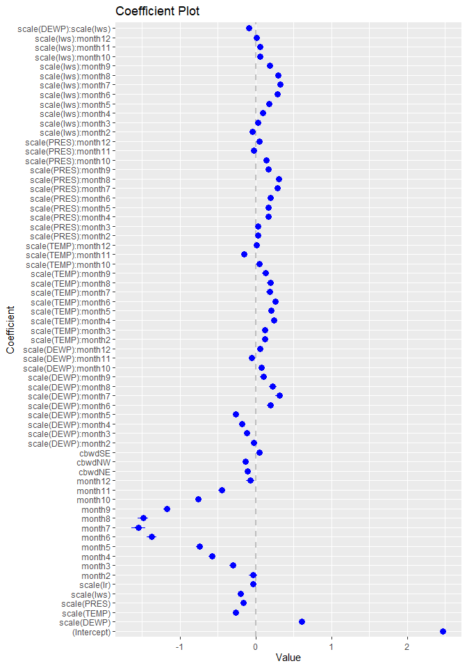

We see:

-   A majority of 'month' and 'DEWP' have large standardized coefficients in absolute value.
-   This suggests that month and DEWP are important variables in predicting PM2.5.

### Model Diagnostics

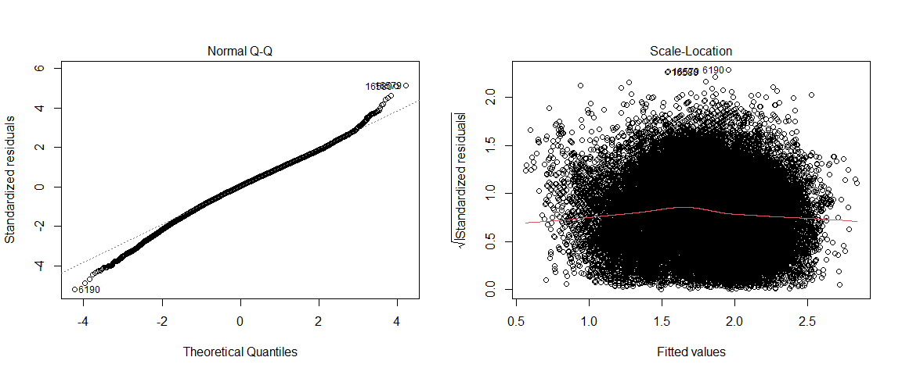

Since our original data was heavily skewed and violated the assumption of normality, performing a log transformation to the data seemed to help alleviate this issue.

We see:

-   In the QQ plot, most of the residuals follow a straight line.
-   In the Scale-Location plot, the residuals appear to spread equally .
-   The assumption of normality and constant variance seem to be satisfied.
